# FBCMJ Mobile ESL Onboarding Guide

Welcome to class! We're so excited you're here! The First Mt. Juliet staff and everyone involved in our ESL ministry are so grateful to God that He has given us the opportunity to serve you this semester. We pray that this class will be a blessing to you, and we hope that you find this onboarding guide helpful.

## 1. First, let's get you on the church Wi-Fi :id=church-wifi
Just tap the button below!

<a class="content-button" href="WIFI:T:WPA;S:FBC Guest;P:Grace&amp;Peace;;">Join FBC Guest Wi-Fi</a>

## 2. You need an email account! :id=email-account
### Already have email? Skip ahead to&nbsp;[Step 3](#pearson-account)

If you don't already have an email address, no worries! We'll walk you through creating a new Gmail account.

#### 1. Before tapping the button in the next step, you'll need to have the following information ready to go:
- Your first name
- Your last name
- Your birthday
- Your gender
- A name of your choice for your new email address (like `johndoe1776@gmail.com`)
- Your phone number (linking it helps keep your account safe)
- A password, which must include:
  - 8 characters or more
  - At least one special character / symbol
  - At least 1 uppercase letter
  - At lease 1 lowercase letter
  - Does not contain your email name (like `johndoe` if your email address is `johndoe1776@gmail.com`)

When Google asks what the account is for, you will choose **"For my personal use"**.

#### 2. When you've got all your information ready, tap the button below.

> Tapping the button will open a **new tab** in your browser so you can **switch back to this guide**. If you don't know how to switch back and forth between tabs in your browser, just ask for help!

[Create a new Gmail account](https://accounts.google.com/signup ":class=content-button")

#### 3. Enter your first name and last name, then tap "Next"

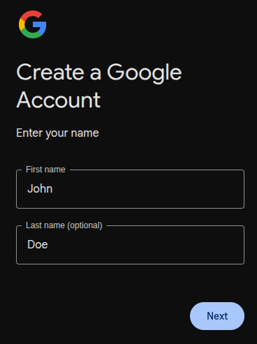

#### 4. Enter your birthday and gender, then tap "Next"

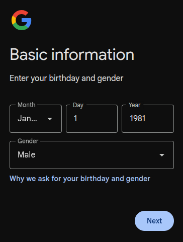

#### 5. Enter your desired email address name
You don't need to type in the `@gmail.com` part, just the first part like `johndoe1776`

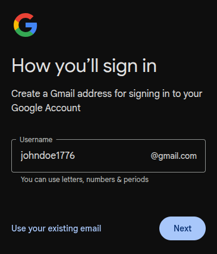

> If the email address you chose is already taken, try adding some numbers you will remember to the end of it. But **don't include anything secret**, this information is **public**!

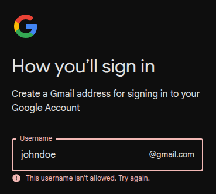

#### 6. Enter your desired password
Type the password you want, then again in the next field, then tap "Next"

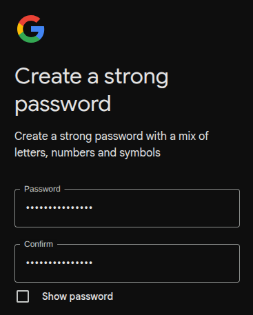

#### 7. Google may ask about your phone number
Do **not** skip this step — linking your phone number helps keep your account safe.
- **On Android:** Google often already knows this number. Tap **"Yes, I'm in"** to confirm it.
- **On iPhone:** Type your phone number, then tap **"Next"**

#### 8. If Google sent you a text with a code
- **On Android:** The code may fill in by itself. If it does not, type the code, then tap **"Next"**
- **On iPhone:** On newer iPhones, the code often appears above the keyboard — tap it to fill it in. If you do not see it, open Messages, then type the code, then tap **"Next"**

#### 9. If Google asks for a recovery email, tap "Skip"
#### 10. If Google shows your account info to review, check that your name and email look correct, then tap "Next"
#### 11. Read Google's Privacy and Terms, then tap "I agree"
#### 12. Your Gmail account is ready!
You can now close that browser tab and come back to this guide for [Step 3](#pearson-account)

> Write down your new Gmail address if you have not already. You will need it for Pearson.

## 3. Create your Pearson account :id=pearson-account
### Already have a Pearson account set up? Skip ahead to&nbsp;[Step 4](#register-books)
If you don't have a Pearson account yet, follow these steps!

#### 1. Before tapping the button in the next step, you'll need to have the following information ready to go:
- Your first name
- Your last name
- Your personal email account that you can access. (go back to [Step 2](#email-account) if you don't already have an email account)
- A username (you can just use your email address for this)
- A password, which must include:
  - 8 characters or more
  - No special characters except `-`, `.`, `@`, or `_`
  - At least 1 uppercase letter
  - At lease 1 lowercase letter
- When asked for your **Country**, you will choose `United States`
- When asked for your **Role**, you will choose `Student`

#### 2. When you've got all your information ready, tap the button below.

> Tapping the button will open a **new tab** in your browser so you can **switch back to this guide**. If you don't know how to switch back and forth between tabs in your browser, just ask for help!

[Create a new Pearson account](https://login.pearson.com/v1/piapi/iesui/signup ":class=content-button")

#### 3. Fill out the online form with your information.
#### 4. Tap the checkbox to agree to Pearson's terms of use and privacy policy.

Here's what the form should look like when it's all filled out:

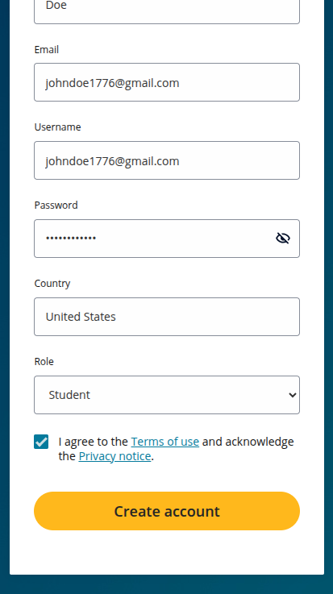

#### 5. Tap the "Create account" button, then tap "Continue" after your account is created

> **Hold on**! Be ready to check your text messages. The next step has a 1 minute timer.

#### 6. When asked for your phone number, enter it, then tap "Send verification code"

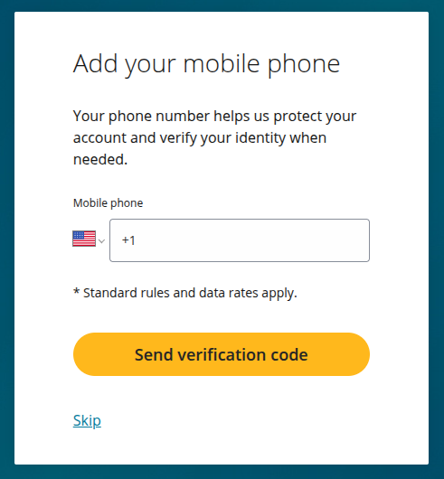

#### 7. You will get a text message with a 6-digit code
#### 8. Enter the code into the website and tap "Verify", then "Continue"

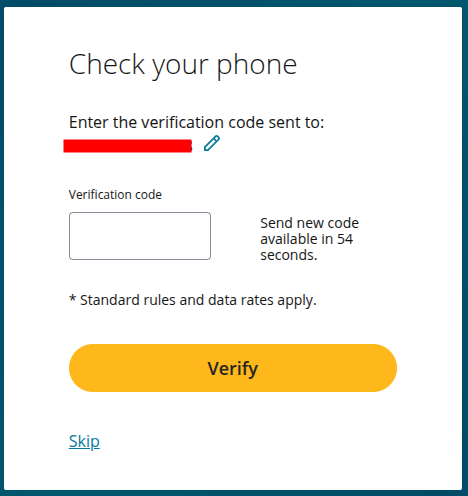

#### 9. After your account has been created, you will arrive at the "My courses" page
You can now close that browser tab for now

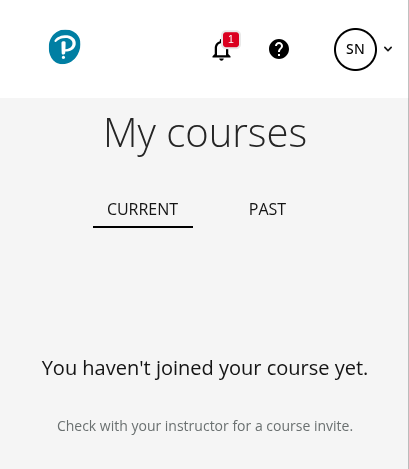

#### 10. Finally, you need to verify your email address with Pearson
- Check your email app, you should have a new email from Pearson to "Verify your email address for your Pearson Account"
- Tap the "Verify" button in the email
- That should take you back to the "My courses" page

## 4. Register your books :id=register-books
#### 1. Get your student access codes
Each of your books has a **separate**, individual student access code.

> **Watch out!** Certain coins can damage your code when you scratch-off the silver area. It is recommended to use a **credit card** (or similar card) to scratch off your code.

- On each of your books, look on the back of the cover page for the **silver scratch-off area**
- Scratch off the area with a **credit card** (or similar card)

#### 2. Before tapping the button in the next step, you'll need:
- Your Pearson **username** and **password** from [Step 3](#pearson-account)
- Your **student access codes** from each of your books

#### 3. When you have your access code ready, tap the button below.

> Tapping the button will open a **new tab** in your browser so you can **switch back to this guide**. If you don't know how to switch back and forth between tabs in your browser, just ask for help!

[Open Pearson English Portal](https://english-dashboard.pearson.com/ ":class=content-button")

#### 4. Sign in with your Pearson username and password from Step 3
#### 5. If you are prompted for "Legal Policies", review the "Terms of use" and "Privacy notice", then tap "Continue"
#### 6. On your Dashboard, tap "Add product" :id=add-product-button

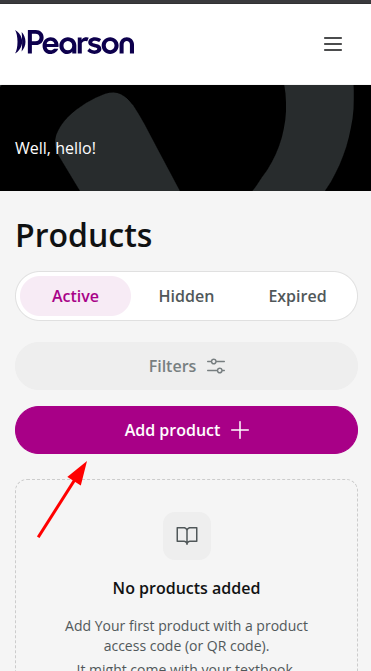

#### 7. Type your code **exactly as written** (including `-`s) in the field, then tap "Add product"

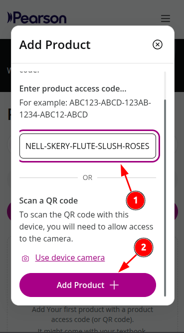

#### 8. If you are prompted to take a tour of the site, just tap the X button

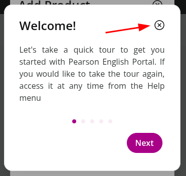

#### 9. When you see the rocket ship, tap "Back to Dashboard"

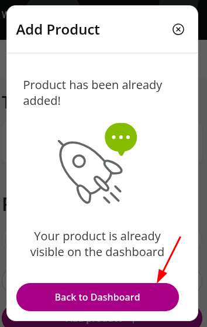

#### 10. If you have more books to register, go back to [Add product](#add-product-button) and repeat the process for your other books

#### 11. You should now see your book(s) on your Dashboard

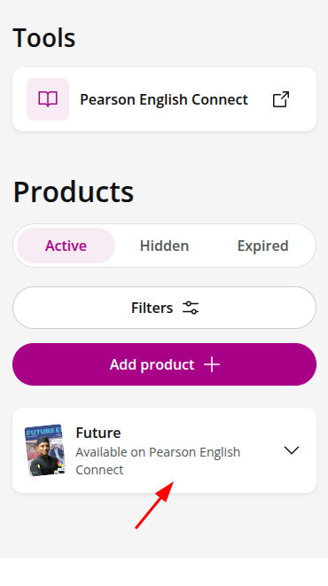

## 5. Get the Pearson Practice English app :id=pearson-app

#### 1. Tap the Play store button for Android, or the App Store button for iPhone

#### 2. Tap "Install" (Android) or "Get" (iPhone), then wait until the app finishes installing
#### 3. Tap "Open" (or tap the Pearson Practice English app icon)
#### 4. Tap "My Profile" at the bottom of the screen
#### 5. Tap "LET’S GO!"

#### 6. Sign in with your Pearson username and password from Step 3, then tap "Continue"

> Use the account you already created in [Step 3](#pearson-account). Do **not** tap "Create an account".

#### 7. You are signed in!
You can come back to this guide any time if you need help.

